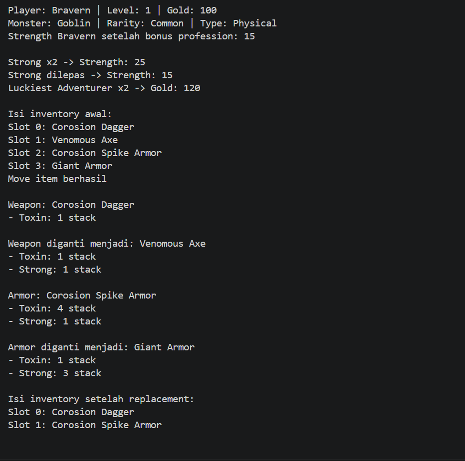
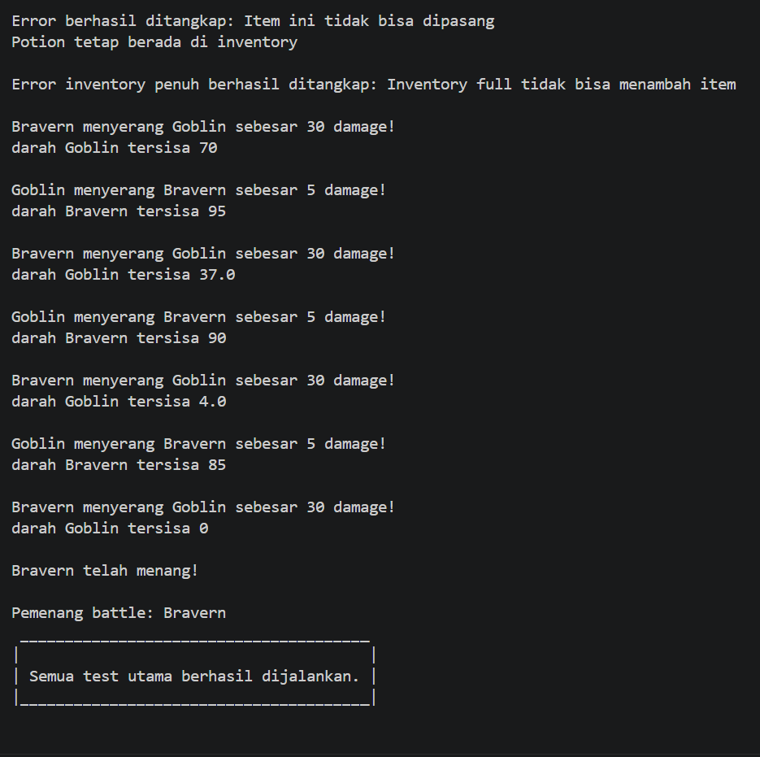

# CLI Adventure

## Deskripsi Program

**CLI Adventure** adalah program petualangan sederhana berbasis Command Line Interface (CLI) yang dibuat menggunakan Python dan konsep Object-Oriented Programming (OOP).

Program menggambarkan seorang pemain yang memiliki profesi, statistik, inventory, equipment, dan trait. Pemain dapat menggunakan weapon dan armor, mendapatkan efek trait dari equipment, kemudian bertarung melawan monster.

Pada pengembangan kali ini, program berfokus pada penerapan:

- Relasi UML
  - Association
  - Aggregation
  - Composition
- Inheritance
- Penggunaan `super()`
- Method overriding
- Atribut khusus pada subclass

Selain itu, beberapa sistem dari pengembangan sebelumnya tetap digunakan, seperti Trait, Inventory, Equipment, Status Effect, dan Battle.

---

# Struktur Program

Beberapa class utama yang digunakan pada program adalah:

```text
Character
├── Player
└── Monster

Item
├── Weapon
│   ├── CorosionDagger
│   └── VenomousAxe
└── Armor
    ├── CorosionSpikeArmor
    └── GiantArmor

Trait
├── StatsTrait
│   └── Strong
├── BattleTrait
│   └── Toxin
└── ResourceTrait
    └── LuckiestAdventurer
```

Selain class tersebut, terdapat beberapa class pendukung:

```text
Stats
Profession
Combatant
Battle
Inventory
Equipment
TraitManager
TraitEntry
PoisonStatus
```

Class-class tersebut saling bekerja sama untuk membentuk sistem permainan.

---

# Inheritance

Inheritance digunakan ketika beberapa class memiliki dasar atau karakteristik yang sama.

Pada program ini, salah satu inheritance utama terdapat pada `Character`.

```text
           Character
           /       \
          /         \
      Player       Monster
```

`Character` berperan sebagai superclass, sedangkan `Player` dan `Monster` menjadi subclass.

## Superclass `Character`

Class `Character` menyimpan data yang dimiliki oleh semua karakter.

Contoh:

```python
class Character:
    def __init__(self, name: str, stats: Stats) -> None:
        self._name = name
        self._stats = stats
        self.__trait_manager = TraitManager()

    def get_info(self) -> str:
        return f"Character: {self._name}"
```

Baik Player maupun Monster sama-sama membutuhkan nama, statistik, dan TraitManager. Karena itu, data tersebut ditempatkan di `Character` agar tidak perlu ditulis ulang pada masing-masing subclass.

---

## Subclass `Player`

`Player` merupakan turunan dari `Character`.

```python
class Player(Character):
    def __init__(self, name: str, stats: Stats, lives: int, level: int, gold: int, profession: Profession) -> None:
        super().__init__(name, stats)
        self.lives = lives
        self.level = level
        self.gold = gold
        self.profession = profession
        self.inventory = Inventory()
        self.equipment = Equipment()
```

Bagian:

```python
super().__init__(name, stats)
```

digunakan agar constructor milik `Character` tetap dijalankan.

Setelah itu, `Player` menambahkan atribut yang khusus dimiliki pemain, seperti:

```text
lives
level
gold
profession
inventory
equipment
```

Dengan demikian, Player tetap memiliki sifat dasar Character tetapi juga mempunyai data dan kemampuan tambahan.

---

## Subclass `Monster`

`Monster` juga merupakan turunan dari `Character`.

Contoh:

```python
class Monster(Character):
    def __init__(self, name: str, stats: Stats, rarity: str, monster_type: str) -> None:
        super().__init__(name, stats)
        self.rarity = rarity
        self.monster_type = monster_type
```

Monster memiliki atribut khusus yang berbeda dari Player:

```text
rarity
monster_type
```

Contohnya:

```python
goblin = Monster(name="Goblin", stats=Stats(5, 5, 2, 3, 0), rarity="Common", monster_type="Physical")
```

---

# Method Overriding

Method overriding terjadi ketika subclass membuat ulang method yang sudah dimiliki superclass.

Pada `Character` terdapat method:

```python
def get_info(self) -> str:
    return f"Character: {self.name}"
```

Kemudian Player memberikan informasi yang lebih sesuai untuk Player.

```python
def get_info(self) -> str:
    return (f"Player: {self.name} | " f"Level: {self.level} | " f"Gold: {self.gold}")
```

Monster juga dapat memberikan informasi dengan format yang berbeda.

```python
def get_info(self) -> str:
    return (f"Monster: {self.name} | " f"Rarity: {self.rarity} | " f"Type: {self.monster_type}")
```

Walaupun method yang dipanggil sama:

```python
bravern.get_info()
goblin.get_info()
```

hasilnya berbeda karena masing-masing subclass memiliki implementasinya sendiri.

Contoh output:

```text
Player: Bravern | Level: 1 | Gold: 100
Monster: Goblin | Rarity: Common | Type: Physical
```

---

# Relasi UML

Selain inheritance, program juga menerapkan beberapa hubungan antar-object.

Relasi yang digunakan pada program adalah:

```text
Association
Aggregation
Composition
```

---

## 1. Association

Association digunakan ketika dua object saling menggunakan atau berinteraksi, tetapi tidak saling memiliki secara permanen.

Pada program ini, salah satu contoh association terdapat pada method `attack()` di dalam class `Combatant`.

```python
def attack(self, target: Combatant) -> None:
    target.take_damage(self.owner.stats.strength)
```

Pada method tersebut, object `target` diterima sebagai parameter dan hanya digunakan saat proses serangan berlangsung.

Combatant yang menyerang tidak menyimpan `target` sebagai atribut tetap di dalam object-nya.

Contohnya:

```python
bravern_combatant.attack(goblin_combatant)
```

Dalam pemanggilan tersebut, `goblin_combatant` digunakan oleh `bravern_combatant` sebagai target serangan.

Setelah proses serangan selesai, kedua object tetap dapat berdiri sendiri dan tidak bergantung satu sama lain.

Karena itu hubungan tersebut termasuk **association**.

```text
Combatant ..> Combatant
          menyerang
```

Relasi ini menunjukkan bahwa satu `Combatant` menggunakan `Combatant` lain sebagai target melalui parameter method, tanpa memiliki target tersebut secara permanen.

---

## 2. Aggregation

Aggregation menggambarkan hubungan "memiliki", tetapi object yang dimiliki masih dapat berdiri sendiri.

Salah satu contohnya terdapat pada hubungan:

```text
Combatant ◇------ Character
```

Combatant memiliki `owner` berupa Character.

Contoh:

```python
bravern = Player(...)

bravern_combatant = Combatant(owner=bravern, max_health=100)
```

Object `bravern` sudah ada sebelum `bravern_combatant` dibuat.

Jika Combatant sudah tidak digunakan setelah pertarungan selesai, Player tetap dapat digunakan untuk hal lain seperti:

```text
Inventory
Equipment
Gold
Level
Trait
```

Karena Character dapat tetap hidup tanpa Combatant, hubungan ini merupakan **aggregation**.

---

Contoh aggregation lainnya dapat dilihat pada Inventory dan Item.

```text
Inventory ◇------ Item
```

Item dapat dibuat terlebih dahulu:

```python
dagger = CorosionDagger()
```

kemudian dimasukkan ke Inventory:

```python
bravern.inventory.add_item(dagger)
```

Item juga dapat dikeluarkan kembali dari Inventory.

Karena Item tidak bergantung sepenuhnya kepada Inventory untuk keberadaannya, hubungan tersebut juga dapat digambarkan sebagai aggregation.

---

## 3. Composition

Composition merupakan hubungan yang kuat antara object induk dan object bagian.

Object bagian dibuat langsung di dalam object induk dan menjadi bagian dari object tersebut.

Pada program ini, contoh composition terdapat pada hubungan antara `Character` dan `TraitManager`.

```text
Character ◆------ TraitManager
```

Pada saat object `Character` dibuat, object `TraitManager` juga langsung dibuat di dalam constructor.

```python
class Character:
    def __init__(self, name: str, stats: Stats) -> None:
        self._name = name
        self._stats = stats
        self.__trait_manager = TraitManager()
```

`TraitManager` digunakan sebagai bagian internal dari Character untuk mengelola Trait yang dimiliki oleh karakter.

Dengan demikian, setiap Character memiliki TraitManager miliknya sendiri.

Contoh composition lain pada program adalah hubungan antara `Player` dan `Equipment`.

```text
Player ◆------ Equipment
```

Pada saat Player dibuat, Equipment juga dibuat langsung di dalam Player.

```python
self.equipment = Equipment()
```

Equipment menjadi bagian langsung dari Player dan digunakan untuk menyimpan weapon serta armor yang sedang digunakan.

---

# Ringkasan Relasi UML

Relasi utama pada program dapat diringkas seperti berikut:

```text
INHERITANCE

Player  ------▷ Character
Monster ------▷ Character


ASSOCIATION

Combatant ..> Combatant
          menyerang


AGGREGATION

Combatant ◇------ Character

Inventory ◇------ Item


COMPOSITION

Character ◆------ TraitManager

Player ◆--------- Equipment
```


---

# Alur Program

Program dimulai dengan membuat Player dan Monster.

```text
Membuat Stats
      ↓
Membuat Profession
      ↓
Membuat Player
      ↓
Membuat Monster
```

Player memperoleh tambahan statistik dari Profession.

Contohnya Bravern dibuat dengan statistik dasar:

```python
Stats(10, 8, 5, 3, 1)
```

dan Profession Warrior:

```python
Profession("Warrior", Stats(5, 3, 3, 0, 0))
```

Sehingga Strength awal Player bertambah.

---

Setelah Player dibuat, item dapat dimasukkan ke Inventory.

```text
Player
  ↓
Inventory
  ↓
Weapon / Armor
```

Contoh:

```python
dagger = CorosionDagger()
axe = VenomousAxe()

bravern.inventory.add_item(dagger)
bravern.inventory.add_item(axe)
```

Untuk menggunakan item dari Inventory:

```python
bravern.equip_from_inventory(0)
```

Player mengambil item dari Inventory dan memasangnya pada Equipment.

Jika sebelumnya sudah terdapat equipment pada slot tersebut, equipment lama dilepas dan dikembalikan ke Inventory.

Alurnya:

```text
Pilih item di Inventory
        ↓
Cek apakah Weapon / Armor
        ↓
Keluarkan dari Inventory
        ↓
Cek equipment lama
        ↓
Equipment lama kembali ke Inventory
        ↓
Pasang equipment baru
        ↓
Aktifkan Trait item
```

---

# Trait dari Equipment

Weapon dan Armor dapat membawa Trait.

Contohnya:

```text
Corosion Dagger
└── Toxin x1

Venomous Axe
├── Toxin x1
└── Strong x1

Corosion Spike Armor
└── Toxin x3

Giant Armor
└── Strong x2
```

Trait dengan jenis yang sama akan digabung oleh `TraitManager`.

Sebagai contoh ketika Player menggunakan:

```text
Venomous Axe
+
Corosion Spike Armor
```

Trait aktif menjadi:

```text
Toxin  x4
Strong x1
```

Jika Corosion Spike Armor kemudian diganti dengan Giant Armor:

```text
Venomous Axe
+
Giant Armor
```

hasilnya:

```text
Toxin  x1
Strong x3
```

---

# Alur Battle

Sebelum battle dimulai, Character dibuat menjadi Combatant.

Contoh:

```python
bravern_combatant = Combatant(owner=bravern, max_health=100)

goblin_combatant = Combatant(owner=goblin, max_health=100)
```

Kemudian keduanya diberikan kepada Battle.

```python
battle = Battle(bravern_combatant, goblin_combatant)

battle.start()
```

Alur pertarungan:

```text
Player dan Monster
        ↓
Dibuat menjadi Combatant
        ↓
Battle menerima kedua Combatant
        ↓
Bandingkan Agility
        ↓
Tentukan giliran pertama
        ↓
Attacker menyerang Target
        ↓
Trait Battle dijalankan
        ↓
Status Effect diproses
        ↓
Cek Health
        ↓
Berganti giliran
        ↓
Salah satu Combatant kalah
        ↓
Battle menentukan pemenang
```

Trait `Toxin` dapat memberikan status Poison kepada lawan.

Poison memberikan damage pada beberapa giliran berikutnya hingga durasinya habis.

---

# Cara Menjalankan Program

## 1. Persiapan

Pastikan Python sudah terpasang.

Program dikembangkan menggunakan Python 3.

Buka terminal pada root folder project.

Struktur sederhananya:

```text
CLI-Adventure/
│
├── characters/
├── combat/
├── equipment/
├── inventory/
├── items/
├── utils/
│
└── main.py
```

---

## 2. Menjalankan Program

Jalankan:

```bash
python main.py
```

Jika pada perangkat perintah Python menggunakan `python3`, gunakan:

```bash
python3 main.py
```

Pastikan command dijalankan dari folder utama project agar import antar-file dapat ditemukan dengan benar.

---

# Panduan Pengujian

File `main.py` digunakan untuk menjalankan pengujian sederhana terhadap fitur-fitur utama program.

Pengujian dibuat secara berurutan agar alur program lebih mudah dibaca.

---

## 1. Player dan Monster

Program membuat object Player dan Monster.

```python
bravern = Player(...)
goblin = Monster(...)
```

Kemudian method overriding diuji:

```python
print(bravern.get_info())
print(goblin.get_info())
```

Contoh output:

```text
Player: Bravern | Level: 1 | Gold: 100
Monster: Goblin | Rarity: Common | Type: Physical
Strength Bravern setelah bonus profession: 15
```

Bagian ini menunjukkan inheritance dan method overriding pada `Character`, `Player`, dan `Monster`.

---

## 2. Trait

Trait `Strong` ditambahkan kepada Player.

```python
bravern.trait_manager.add_trait(strong, bravern, 2)
```

Output:

```text
Strong x2 -> Strength: 25
```

Ketika trait dilepas:

```text
Strong dilepas -> Strength: 15
```

Trait Resource juga diuji menggunakan `LuckiestAdventurer`.

```text
Luckiest Adventurer x2 -> Gold: 120
```

---

## 3. Inventory

Beberapa item dimasukkan ke Inventory.

Contoh output:

```text
Isi inventory awal:

Slot 0: Corosion Dagger
Slot 1: Venomous Axe
Slot 2: Corosion Spike Armor
Slot 3: Giant Armor
```

Program juga menguji perpindahan item antar-slot menggunakan `move_item()`.

```text
Move item berhasil
```

---

## 4. Equipment

Corosion Dagger pertama kali dipasang.

```text
Weapon: Corosion Dagger

- Toxin: 1 stack
```

Kemudian diganti dengan Venomous Axe.

```text
Weapon diganti menjadi: Venomous Axe

- Toxin: 1 stack
- Strong: 1 stack
```

Armor kemudian digunakan.

```text
Armor: Corosion Spike Armor

- Toxin: 4 stack
- Strong: 1 stack
```

Setelah diganti Giant Armor:

```text
Armor diganti menjadi: Giant Armor

- Toxin: 1 stack
- Strong: 3 stack
```

Bagian ini sekaligus menunjukkan hubungan antara:

```text
Player
Inventory
Equipment
Item
TraitManager
Trait
```

---

## 5. Item yang Tidak Dapat Dipasang

Tidak semua Item merupakan Weapon atau Armor.

Contohnya:

```python
potion = Item("Potion")
```

Jika Potion dicoba dipasang:

```python
bravern.equip_from_inventory(potion_slot)
```

program akan menolak operasi tersebut.

Contoh output:

```text
Error berhasil ditangkap:
Item ini tidak bisa dipasang

Potion tetap berada di inventory
```

Item tidak hilang karena program melakukan pemeriksaan terlebih dahulu sebelum mengubah isi Inventory.

---

## 6. Inventory Penuh

Program juga menguji kondisi ketika Inventory sudah penuh.

Contoh output:

```text
Error inventory penuh berhasil ditangkap:
Inventory full tidak bisa menambah item
```

Hal ini memastikan jumlah Item tidak dapat melebihi kapasitas Inventory.

---

## 7. Battle

Bagian terakhir menjalankan pertarungan antara Bravern dan Goblin.

```python
battle = Battle(bravern_combatant, goblin_combatant)

winner = battle.start()
```

Pada testing, peluang Toxin dibuat 100% agar efeknya pasti muncul dan hasil pengujian tidak bergantung pada nilai random.

Contoh output battle:

```text
Bravern menyerang Goblin sebesar 30 damage!
darah Goblin tersisa 70

Goblin menyerang Bravern sebesar 5 damage!
darah Bravern tersisa 95

...

Bravern telah menang!

Pemenang battle: Bravern
```

Jika seluruh pengujian berhasil, program menampilkan:

```text
 _______________________________________
|                                       |
| Semua test utama berhasil dijalankan. |
|_______________________________________|
```

---

# Penggunaan `assert`

Beberapa bagian pengujian menggunakan `assert`.

Contoh:

```python
assert bravern.stats.strength == 15
```

`assert` digunakan untuk memastikan hasil program sesuai dengan hasil yang diharapkan.

Jika kondisi benar, program akan lanjut seperti biasa.

Jika kondisi salah, Python akan menghentikan pengujian dengan `AssertionError`.

Contoh lain:

```python
assert isinstance(bravern.equipment.weapon, VenomousAxe)
```

Pengujian tersebut memastikan bahwa weapon yang digunakan setelah proses replacement benar-benar `VenomousAxe`.

---

# Hasil Pengujian

Pengujian pada `main.py` mencakup:

1. Pembuatan Player dan Monster.
2. Inheritance dan method overriding.
3. Bonus statistik dari Profession.
4. Trait `Strong`.
5. Trait `LuckiestAdventurer`.
6. Penambahan Item ke Inventory.
7. Pemindahan Item antar-slot.
8. Penggunaan Weapon.
9. Replacement Weapon.
10. Penggunaan Armor.
11. Replacement Armor.
12. Penggabungan stack Trait.
13. Penolakan Item yang tidak dapat dipasang.
14. Validasi Inventory penuh.
15. Battle antara Player dan Monster.
16. Status Effect dari Toxin.
17. Penentuan pemenang Battle.


## Hasil Pengujian

Bagian pertama pengujian mencakup pembuatan Player dan Monster, Trait, Inventory, serta Equipment.



Bagian kedua mencakup validasi error, Inventory penuh, Battle, Status Toxin, dan hasil akhir pengujian.



---

# Kesimpulan

CLI Adventure menggunakan beberapa class yang saling terhubung untuk membentuk sebuah sistem permainan sederhana.

Konsep inheritance diterapkan melalui hubungan `Character`, `Player`, dan `Monster`. Data yang sama ditempatkan pada superclass `Character`, sedangkan Player dan Monster menambahkan atribut dan perilaku masing-masing.

Penggunaan `super()` memungkinkan subclass tetap menjalankan constructor milik superclass tanpa menulis ulang proses yang sama.

Method overriding digunakan agar Player dan Monster dapat menggunakan method dengan nama yang sama tetapi menghasilkan informasi yang sesuai dengan jenis karakternya.

Program juga menerapkan tiga jenis relasi UML.

```text
Association
Battle -------- Combatant

Aggregation
Combatant ◇------ Character
Inventory ◇------ Item

Composition
Player ◆--------- Inventory
Player ◆--------- Equipment
```

Relasi tersebut digunakan sesuai dengan hubungan antar-object di dalam program.

Melalui penerapan inheritance dan relasi UML tersebut, masing-masing class memiliki tanggung jawab yang lebih jelas dan dapat saling bekerja sama tanpa seluruh logika ditempatkan dalam satu class.
